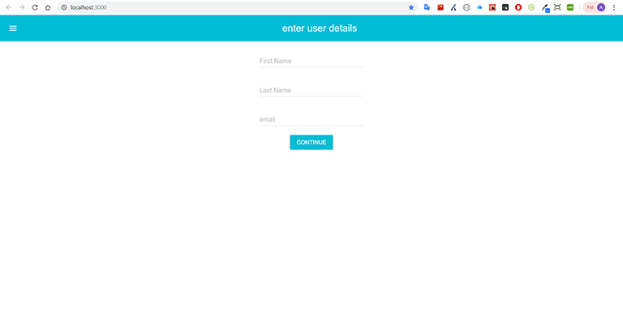

## Navigation between forms example
This is a mini project in haw you can build a navigation in react using materialize
build under my time in Jensen Academy

### Technologies
* React
* materialize-ui

text: 

### Set up the project
Install **create-react-app**, 
Clone this repo by coping the url and in the terminal type: **git clone [paste the url]**
cd to the project and type: **npm install**
To start the project run: **npm start**
In the browser go to localhost:3000

Enjoy!

Andreas Vilhelmsson
